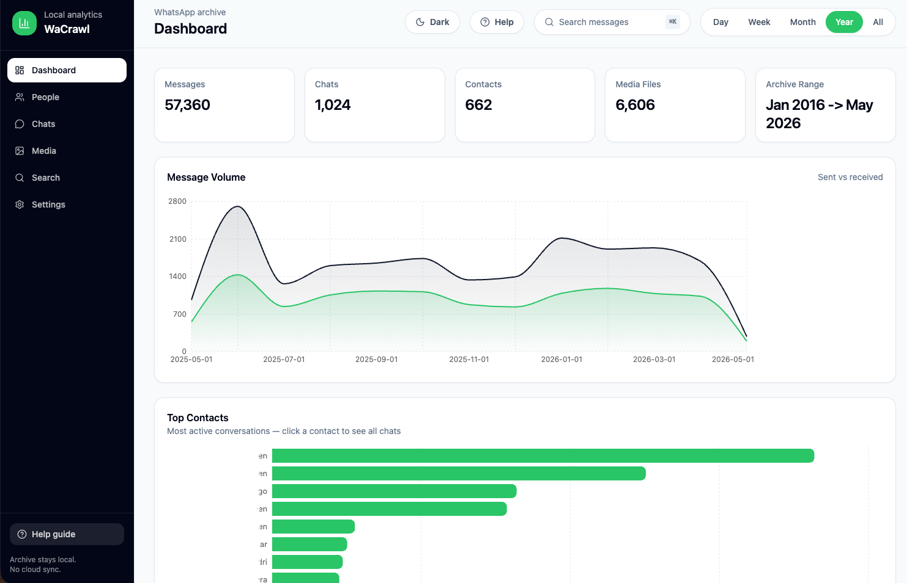

# WaCrawl Dashboard

Local WhatsApp analytics dashboard for the SQLite archive generated by `wacrawl`. A small monorepo runs a **read-only Express API** (`apps/api`) and a **React + Vite** UI (`apps/web`) that talks to it over CORS on localhost only.



## Features

### Dashboard

- **Overview cards** — total messages, chats, contacts, media files, and archive date span; each card can jump to Search, Chats, People, or Media as a shortcut.
- **Time window** — period filter in the top bar (**Day / Week / Month / Year / All**) drives chart stats (default **Year**). The **activity heatmap** uses the current calendar year.
- **Charts and lists** — message volume over time, top contacts (bar chart; click a contact to open **Chats** filtered to that JID), hour-of-day and day-of-week activity, monthly sent vs received vs ratio, media type breakdown (count and bytes), top media senders, response-time averages, busiest groups, messaging streaks (current and longest).
- **Word cloud** — top terms with an **All words** vs **Useful words** (stopword-filtered) toggle.

### People

- Contact-style list ranked by activity, with message, media, sent, and received counts and last message time. Privacy-oriented display for LID-style identifiers (JID hidden when appropriate).

### Chats

- **Two-pane browser** — conversation list (with kind: direct vs group, preview line, counts, last activity) and the latest messages for the selected chat.
- **Read-only inspection** — message bubbles, timestamps, optional **copy message** (including media-aware clipboard text), and inline **images / videos / audio** when paths resolve under your configured media root.
- **Deep links** — `?contact=<jid>` (for example from the dashboard top-contacts chart) selects the matching chat when present.

### Media

- **Paged grid** of indexed media with **infinite scroll** (intersection-based loading).
- Thumbnails for **images** and **videos**, affordances for **audio**, and a full-screen **lightbox** for preview and playback where the type supports it.

### Search

- **FTS-backed** full-text search over message content (plus chat and sender names) against the local archive; debounced queries after two or more characters.
- Result rows show context, optional **image/video thumbnails** and **inline audio**, link detection in snippets, **copy**, and media type badges. Optimized DB (below) is recommended for best performance.

### Settings

- Edit **archive paths** (WhatsApp shared container, primary WaCrawl DB, chat DB, contacts DB, media root) with **save** and **reset to `.env` defaults**.
- **Health** banner shows whether the primary database opens successfully and the resolved path.
- Effective paths combine **environment variables** with optional overrides persisted to `~/.wacrawl/dashboard-paths.json` so `` / `<video>` URLs work without custom browser headers.

### App experience

- **Welcome / help** modal on first visit (stored in `localStorage`); reopen from **Help** in the sidebar or top bar.
- **Dark and light** themes (toggle in the top bar).
- **Keyboard shortcuts** use the **Meta** key (**⌘** on macOS, **Win** on many Windows keyboards): **Meta+K** opens Search; **Meta+1** Dashboard, **Meta+2** People, **Meta+3** Chats, **Meta+4** Media, **Meta+5** Search, **Meta+6** Settings.

### API and safety

- Listens on **`127.0.0.1`** with host and CORS restricted to local dev/preview origins.
- Opens the WaCrawl SQLite database in **readonly** mode where applicable; `/api/health` reports DB readability and resolved paths.

## Requirements

- Node.js 20+
- A WaCrawl archive at `~/.wacrawl/wacrawl.db` (or another path you configure)

## Development

```bash
npm install
npm run dev
```

The API runs on `http://127.0.0.1:3001` and the Vite app runs on `http://localhost:5173`.

Other root scripts:

- **`npm run build`** — build API then web for production.
- **`npm run preview`** — serve the built web app (Vite preview, localhost).
- **`npm run test`** — API unit tests (Vitest).
- **`npm run typecheck`** — TypeScript checks for both workspaces.

## Configuration

Copy `apps/api/.env.example` to `apps/api/.env` (and optionally `apps/web/.env.example` to `apps/web/.env.local`) and edit paths for your WhatsApp container and WaCrawl database.

Supported variables:

- **`WACRAWL_WHATSAPP_CONTAINER`** — folder such as `Library/Group Containers/group.net.whatsapp.WhatsApp.shared`; used to derive default chat, contacts, and media paths when those variables are omitted.
- **`WACRAWL_CHAT_DB`** / **`WACRAWL_CONTACTS_DB`** — explicit paths to `ChatStorage.sqlite` and `ContactsV2.sqlite`.
- **`WACRAWL_MEDIA_ROOT`** — folder containing downloaded media (often `…/Message/Media`); relative paths in the archive resolve against this directory.
- **`WACRAWL_DB`** — primary SQLite file the dashboard queries (WaCrawl export schema from `wacrawl sync`). Defaults to `~/.wacrawl/wacrawl.db`.
- **`WACRAWL_PATHS_FILE`** (optional) — JSON file for UI-saved path overrides; defaults to `~/.wacrawl/dashboard-paths.json`.

On the web side, **`VITE_API_URL`** (default `http://127.0.0.1:3001`) sets the API base URL if your dev setup differs.

You can also open **Settings** in the sidebar (or **Meta+6**): overrides are saved to `~/.wacrawl/dashboard-paths.json` so the API picks them up without relying on browser-only headers (needed for `` / `<video>` URLs).

To run the API once with env overrides:

```bash
WACRAWL_DB=/path/to/wacrawl.db npm run dev -w @wacrawl/api
```

## Search optimization

Prepare the SQLite archive with supporting indexes and an FTS5 search table:

```bash
npm run optimize-db -w @wacrawl/api
```

Use `WACRAWL_DB=/path/to/wacrawl.db` with the same command to optimize a non-default archive. Re-run this after `wacrawl sync` so the FTS table includes newly synced messages.
