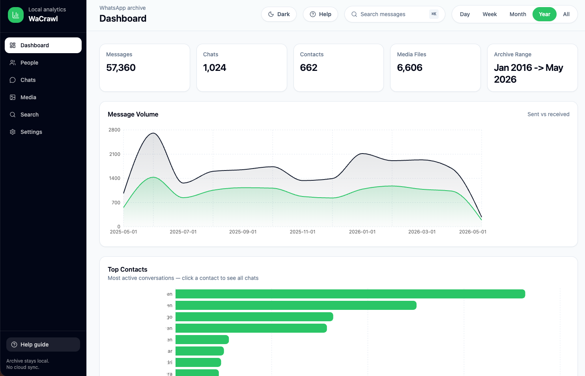

# WaCrawl Dashboard 📊💬

> *Your WhatsApp history, finally looked at by someone other than you at 2 a.m.*

A local analytics dashboard for the SQLite archive produced by [wacrawl](https://github.com/steipete/wacrawl). It answers the questions you never asked out loud: who texts you first, who ghosts you, which group chat is really a monologue, and exactly how many times you've sent 😂 this year. (It's a lot. We've seen your data. Well, *we* haven't. That's the point.)

You can read more about it [here](https://greenido.dev/2026/05/21/unlock-whatsapp-data-with-local-analytics-dashboard/).

Everything runs on your machine. The API binds to `127.0.0.1`, opens the archive **read-only**, and has no interest in phoning home. Your chats stay between you, your friends, and that one cousin who forwards chain messages.



## Quick start

```bash
npx wacrawl-dashboard@latest
```

That's it. It opens on `http://127.0.0.1:3001`. You need **Node 20+** and a WaCrawl archive at `~/.wacrawl/wacrawl.db`.

Keep your archive somewhere else?

```bash
WACRAWL_DB=/path/to/wacrawl.db npx wacrawl-dashboard@latest
```

No archive yet? Install [wacrawl](https://github.com/steipete/wacrawl) and run `wacrawl sync` first. The dashboard reads the archive; it doesn't create it.

## What's inside

### 🏠 Dashboard: the big picture

- **Overview cards.** Total messages, chats, contacts, media files and archive date span. Each card is also a shortcut to Search, Chats, People or Media.
- **Time window.** The top-bar filter (**Day / Week / Month / Year / All**) drives the charts. It defaults to **Year**. The **activity heatmap** always shows the current calendar year.
- **Timezone-aware.** Hour-of-day and heatmap buckets use *your* browser's timezone, not UTC. Your 11 p.m. texting habit is recorded at 11 p.m., where it belongs.
- **Charts, charts, charts.** Message volume over time, top contacts (click one to jump to their chat), hour-of-day and day-of-week activity, monthly sent vs. received, media breakdown by count and bytes, top media senders, busiest groups, and messaging streaks (current and longest).
- **Weekly rhythm.** An hour × weekday grid, so "Sunday night" shows up as the peak it is instead of being averaged away into two separate bar charts.
- **How fast replies happen.** Every point where a conversation changed hands, bucketed by reply time and split into **You** vs. **Them**. It's data now, so you can't say "I was busy."
- **Drifted away.** People you used to message regularly who have gone quiet, comparing recent traffic against an earlier baseline. Mildly poignant. Maybe text them?
- **Buried, not dead.** How many chats you've archived, and which archived ones are still getting messages anyway. You tried.
- **Word cloud.** Top terms, with an **All words** vs. **Useful words** (stopwords removed) toggle. Click a term to search for it.
- **Distinctive words.** Not your *most common* words, the ones that mark a message as yours (or as theirs), ranked by log-odds so everyday words cancel out. Often it's just your name, as said by everyone else.
- **Emoji analytics.** Total and unique emoji, top emoji by **All / Sent / Received**, and a leaderboard of who uses emoji most, with each person's favourite.
- **Conversation dynamics:**
  - **Who starts conversations.** Initiation ratio per contact. A session starts after a gap of 4 hours or more.
  - **Conversation depth.** Average messages per session, so you can see which chats go deep and which stop at "k."
  - **Ghost score.** The percentage of your messages that got no reply within 24 hours, colour-coded by severity. 👻
  - **Late-night texters.** Who you talk to between midnight and 5 a.m. No judgement. Some judgement.
  - **Relationship trajectory.** A monthly sparkline per contact showing whether things are *growing*, *fading* or *stable*.
- **Loading splash.** Rotating quotes to keep you company while SQLite does the heavy lifting.

### 👥 People and contact profiles

- A contact list ranked by activity, with message, media, sent and received counts and the time of the last message. LID-style identifiers are hidden when showing them would reveal nothing useful.
- Click anyone to open their **profile** at `/contacts/:jid`:
  - **Balance.** Who does more of the talking.
  - **Turnaround.** How fast each of you replies.
  - **Volume by month.**
  - **When you talk.** By hour and weekday.
  - **Media exchanged.**
  - **What you talk about.** Their personal word and emoji cloud.

### 🗣️ Groups and group profiles

- Every group, sortable by **Recently active**, **Most members** or **Most messages**.
- **Group graveyard** (on the Dashboard). The share of your groups with no message in 180+ days, median group age, the oldest group still alive, groups founded per year split into *still active* vs. *silent*, and the once-loudest groups that went quiet.
- Each group gets a **profile** at `/groups/:jid`:
  - **Who carries it.** The top talkers.
  - **The room.** The member roster.
  - **Concentration.** How much of the chat comes from a handful of people. Spoiler: usually a handful.
  - **Volume by month** and **When it talks.**
  - **Never posted.** The lurkers, named.
  - **Media shared** and **What it talks about.**
- The dashboard works out which roster entry is *you*, even though WhatsApp never records your own JID in groups. You won't show up as the quietest member of all your groups. (An earlier version did exactly that, and the lurker report named the person reading it.)

### 🎁 Year in Review

A Wrapped-style recap for any year in your archive (`/years/:year`): headline totals, busiest day and month, a year-over-year comparison, top chats, chats that started that year, and a media summary. It's like Spotify Wrapped, except you are the artist and the song is "sorry, just saw this."

### 💬 Chats

- **Two-pane browser.** The conversation list on the left (direct vs. group, preview line, counts, last activity) and the messages on the right.
- **Read-only inspection.** Message bubbles, timestamps, **copy message** (media-aware), and inline **images, videos and audio** when their paths resolve under your media root.
- **Deep links.** `?contact=<jid>` preselects a chat, which is how the top-contacts chart jumps straight to a chat.

### 🖼️ Media and links

- **Media grid.** Infinite-scrolling thumbnails for images and videos, controls for audio, and a full-screen lightbox.
- **Link intelligence**, a full report on every URL anyone has sent you:
  - Total links and unique domains.
  - A **domain leaderboard**, colour-coded by category.
  - **Content categories:** *Video, Social, News, Shopping, Music, Developer, Reference* and *Other*. Yes, you can finally measure how many YouTube links your uncle sends.
  - **Media timeline.** Daily images, videos, audio and links, stacked.
  - **Sharing asymmetry.** Who sends you the most media and links, and how many you send back.
  - **First shared.** The earliest message and earliest media item in each conversation.

### 🔎 Search

- Full-text search (FTS5) over message content, chat names and sender names. Queries are debounced and start after two characters.
- Results show context, image and video thumbnails, inline audio, clickable links, media badges and a copy button.

### ⚙️ Settings

- Edit **archive paths** (WhatsApp shared container, primary WaCrawl DB, chat DB, contacts DB, media root), then **save** or **reset to `.env` defaults**.
- A **health** banner tells you whether the primary database opens, and at which resolved path.
- Overrides are saved to `~/.wacrawl/dashboard-paths.json`, so `` and `<video>` URLs work without custom browser headers.

### 🔄 Refresh

- The **Refresh button** runs `wacrawl sync` to import new messages, then reloads every panel. The icon spins while the import runs and the button is disabled, so impatient double-clicks do nothing.
- A **"Synced 3 hours ago"** stamp, read from the archive's own `sync_state` table.
- **Automatic refresh** when the app opens, and when the tab regains focus after five or more minutes hidden. Automatic refresh only *refetches*. It never starts an import, so nothing writes to your archive behind your back.
- **Errors are shown, not swallowed.** If `wacrawl sync` refuses (most often with `source contains multiple WhatsApp account identities`), you see the CLI's own message and the next step. The dashboard never passes `--adopt-source` for you, because that flag rewrites which account owns the archive, and that's your call.
- Only one import runs at a time. A second request waits for the first rather than starting a competing writer.
- **The archive is derived data.** The `wacrawl` CLI owns every write; the dashboard only reads. Treat the WhatsApp source, not the archive, as your source of truth.

### ⌨️ Keyboard shortcuts

**Meta** is **⌘** on macOS and **Win** on most Windows keyboards.

| Shortcut | Goes to |
| :-- | :-- |
| **Meta+K** | Search |
| **Meta+1** | Dashboard |
| **Meta+2** | People |
| **Meta+3** | Chats |
| **Meta+4** | Groups |
| **Meta+5** | Media |
| **Meta+6** | Search |
| **Meta+7** | Year in Review |
| **Meta+8** | Settings |

Also: **dark and light themes** (toggle in the top bar), and a **welcome/help modal** on first visit that you can reopen from **Help**.

## 🔒 Privacy and safety

We've taken more care with this than your group chat takes with spoilers.

- The API listens on **`127.0.0.1` only**. Host and CORS checks allow local dev and preview origins only.
- The archive is opened **read-only**. `/api/health` reports whether the DB is readable and which paths it resolved.
- `POST /api/sync` is the only route that starts a process, so it requires an **`X-Wacrawl-Request: 1`** header. CORS stops a cross-origin page from *reading* a response, but not from *sending* a simple POST. A non-simple header forces a preflight, and the origin check rejects it. The CLI is spawned without a shell and with a fixed argument list.
- Set `WACRAWL_DISABLE_SYNC=1` and the API never spawns anything at all.
- Stats responses are cached in memory, keyed on the archive's path, mtime and size, with a 5-minute TTL. Re-syncing or switching archives invalidates the cache.

## 🏗️ How it's built

A small npm-workspaces monorepo:

```
apps/
  api/   Express 5 + better-sqlite3, read-only, TypeScript, Vitest
  web/   React + Vite + Tailwind + Recharts + Zustand
bin/     the `npx wacrawl-dashboard` launcher (serves the built web app from the API)
docs/    PRD, npm publishing notes, screenshot
```

### API endpoints

| Area | Routes |
| :-- | :-- |
| **Data** | `/api/people`, `/api/chats`, `/api/chats/:jid/messages`, `/api/media`, `/api/media/file`, `/api/search`, `/api/messages/:id/offset` |
| **Stats** | `/api/stats/` + `overview`, `top-contacts`, `message-volume`, `activity-heatmap`, `hour-of-day`, `day-of-week`, `media-breakdown`, `media-senders`, `sent-received-ratio`, `response-times`, `reply-latency`, `group-activity`, `streaks`, `word-cloud`, `emoji-analytics`, `conversation-dynamics`, `year-in-review`, `contact-profile`, `dormancy`, `groups`, `group-profile`, `link-intelligence`, `weekly-rhythm`, `distinctive-words`, `group-lifecycle`, `archived-chats` |
| **Sync** | `GET /api/sync/status`, `POST /api/sync` (returns `202`, or `409` if an import is already running) |
| **Settings** | `GET`/`POST /api/settings/paths` |

## 🛠️ Development

```bash
npm install
npm run dev
```

The API runs on `http://127.0.0.1:3001` and Vite on `http://localhost:5173`.

| Script | What it does |
| :-- | :-- |
| `npm run dev` | API + web with hot reload |
| `npm run build` | Production build (API, then web) |
| `npm run preview` | Serve the built web app locally |
| `npm test` | API unit tests (Vitest) |
| `npm run typecheck` | TypeScript checks for both workspaces |
| `npm run lint` / `lint:fix` | ESLint |
| `npm run verify` | Lint + typecheck + tests, the same gate CI runs |

CI (GitHub Actions) runs lint, typecheck, tests and build on every push and PR. Publishing a GitHub release ships to npm with provenance. See [docs/how to publish to npm.md](docs/how%20to%20publish%20to%20npm.md).

> **Test data note:** tests use a synthetic in-memory archive (`apps/api/src/__tests__/testDb.ts`). Please keep it that way. Nobody wants their real group chat immortalised in a test fixture.

## 🧩 Configuration

Copy `apps/api/.env.example` to `apps/api/.env` (and optionally `apps/web/.env.example` to `apps/web/.env.local`), then adjust the paths.

| Variable | Purpose |
| :-- | :-- |
| `WACRAWL_DB` | Primary SQLite archive the dashboard queries (from `wacrawl sync`). Default: `~/.wacrawl/wacrawl.db` |
| `WACRAWL_WHATSAPP_CONTAINER` | WhatsApp shared container folder (e.g. `~/Library/Group Containers/group.net.whatsapp.WhatsApp.shared`). Used to derive the chat, contacts and media paths below when they're unset |
| `WACRAWL_CHAT_DB` / `WACRAWL_CONTACTS_DB` | Explicit paths to `ChatStorage.sqlite` and `ContactsV2.sqlite` |
| `WACRAWL_MEDIA_ROOT` | Folder with downloaded media (often `…/Message/Media`). Relative archive paths resolve against it |
| `WACRAWL_PATHS_FILE` | JSON file for UI-saved overrides. Default: `~/.wacrawl/dashboard-paths.json` |
| `WACRAWL_BIN` | Path to the `wacrawl` executable if it's not on `PATH` |
| `WACRAWL_DISABLE_SYNC` | Set to `1` and Refresh only reloads data. It never spawns `wacrawl sync` |
| `PORT` | API port. Default: `3001` |
| `VITE_API_URL` (web) | API base URL. Default: `http://127.0.0.1:3001` |

You can also change paths from **Settings** (**Meta+8**) instead of editing files.

Run the API once against another archive:

```bash
WACRAWL_DB=/path/to/wacrawl.db npm run dev -w @wacrawl/api
```

## ⚡ Search optimization (probably not needed)

**Recent wacrawl versions don't need this.** wacrawl 0.3.9+ builds and maintains its own `messages_fts(text, chat, sender, media)` table on every import, so Search stays current after each Refresh. Check whether yours has it:

```bash
sqlite3 ~/.wacrawl/wacrawl.db "SELECT COUNT(*) FROM messages_fts;"
```

If that errors, your archive is from an older wacrawl, and you can add indexes and an FTS5 table yourself:

```bash
npm run optimize-db -w @wacrawl/api
```

(Prefix it with `WACRAWL_DB=/path/to/wacrawl.db` to target another archive.)

⚠️ `optimize-db` adds btree indexes (`idx_messages_chat_jid`, `idx_contacts_jid`, `idx_contacts_lid`), but it also **drops and replaces** `messages_fts` with a five-column version of its own. On a wacrawl that maintains its own FTS table, that replacement may not survive the next import, and may break it. Only run it on archives that don't ship an FTS table.

## 🙏 Credits

Built on top of [wacrawl](https://github.com/steipete/wacrawl) by Peter Steinberger, which does the hard part of getting your messages out of WhatsApp. This project just stares at them thoughtfully and makes charts.

## License

MIT. Use it, fork it, and ask it who your real friends are. Just don't blame us for the answer. 🫠
